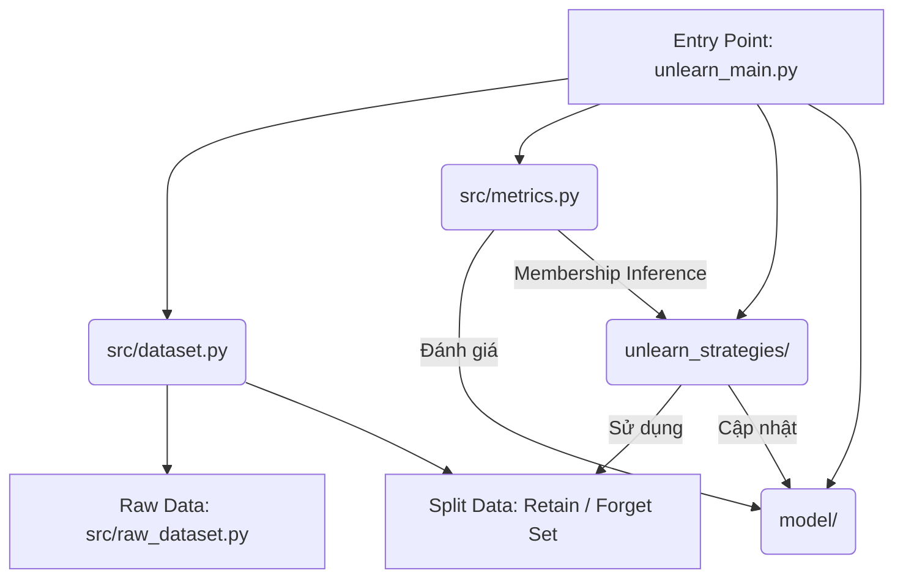

# Phân Tích Mã Nguồn: `src/` - Hệ Thống Machine Unlearning

## 1. Mục đích tổng thể của thư mục `src/`

Thư mục `src/` đóng vai trò là **lớp nền tảng (foundation layer)** cung cấp các tiện ích thiết yếu cho toàn bộ quy trình Machine Unlearning. Nó không chứa logic của chính thuật toán unlearning (nằm trong `unlearn_strategies/`) hay kiến trúc mạng nơ-ron (nằm trong `model/`), mà tập trung vào:
*   **Quản lý dữ liệu (Data Management):** Tải, tiền xử lý, và đặc biệt là phân chia dữ liệu thành tập "giữ lại" (Retain) và tập "cần quên" (Forget).
*   **Đánh giá (Evaluation):** Cung cấp các thước đo chuyên biệt để kiểm chứng hiệu quả của việc "quên" (như tấn công Membership Inference Attack - MIA).
*   **Tiện ích chung (Utilities):** Các hàm hỗ trợ cấu hình, xử lý thiết bị (CPU/GPU), và lưu trữ kết quả.

## 2. Bài toán Machine Unlearning đang giải quyết

Hệ thống đang giải quyết bài toán **Class-wise Unlearning** (Xoá bỏ kiến thức về một lớp cụ thể).

*   **Mục tiêu:** Cho một mô hình $M$ đã được huấn luyện trên tập dữ liệu $D$. Cần tạo ra một mô hình $M_{unlearned}$ sao cho:
    1.  **Unlearning:** $M_{unlearned}$ không còn khả năng nhận diện hoặc chứa thông tin về một lớp cụ thể (ví dụ: lớp "xe tải" trong CIFAR-10), gọi là $D_{forget}$.
    2.  **Retain:** $M_{unlearned}$ vẫn giữ nguyên hiệu năng (độ chính xác) trên các lớp còn lại, gọi là $D_{retain}$.
    3.  **Privacy:** $M_{unlearned}$ phải cư xử như thể nó *chưa bao giờ* nhìn thấy dữ liệu thuộc lớp cần quên.

Hệ thống sử dụng các chiến lược unlearning khác nhau (như thấy trong `unlearn_main.py` các tham số như `lipschitz`, `scrub`, `ssd`, v.v.) dựa trên dữ liệu được chuẩn bị bởi `src/`.

## 3. Kiến trúc tổng thể (High-Level Architecture)

Kiến trúc hệ thống xoay quanh `unlearn_main.py` làm trung tâm điều phối, trong đó `src/` đóng vai trò cung cấp nguyên liệu và công cụ đo lường:



*   **Input:** Dữ liệu thô (MNIST, CIFAR...), Model đã huấn luyện (Pre-trained checkpoints).
*   **Processing (`src/`):** Tách dữ liệu -> Loader.
*   **Core Logic (`unlearn_strategies/`):** Thực thi thuật toán unlearning.
*   **Output:** Unlearned Model, Báo cáo đánh giá (Accuracy, MIA score).

## 4. Phân tích luồng xử lý chính

### a. Điểm bắt đầu (Entry Point)
File `unlearn_main.py` khởi tạo quy trình. Nó gọi `dataset.get_dataset` để tải dữ liệu và quan trọng nhất là `dataset.split_unlearn_dataset` để thiết lập bài toán.

### b. Các bước xử lý dữ liệu
1.  **Load Raw Data:** `src/raw_dataset.py` tải dữ liệu gốc (vd: CIFAR10).
2.  **Split Unlearning:** `src/dataset.split_unlearn_dataset` lọc dữ liệu:
    *   Tất cả mẫu có nhãn `unlearn_class` -> Đưa vào `unlearn_ds` (Forget Set).
    *   Các mẫu còn lại -> Đưa vào `retain_ds` (Retain Set).
3.  **Data Loading:** Tạo `DataLoader` cho `retain`, `unlearn`, và `test`.

### c. Quá trình Unlearning và Đánh giá
*   **Unlearning:** `dataset.UnLearningData` có thể được sử dụng để gộp dữ liệu Retain và Forget nhưng gán nhãn lại (Forget=1, Retain=0) phục vụ cho một số thuật toán hoặc bước tấn công giả lập.
*   **Đánh giá:** Sau khi chạy thuật toán unlearning, `src/metrics.py` được gọi để tính:
    *   `evaluate`: Độ chính xác trên tập Retain (cần cao) và tập Unlearn (cần thấp hoặc ngẫu nhiên).
    *   `mia`: Tỷ lệ thành công của tấn công suy luận thành viên (cần về gần 50% - mức đoán mò, chứng tỏ mô hình không còn nhớ dữ liệu).

## 5. Phân tích từng file trong `src/`

Thư mục `src/` không có thư mục con, chỉ bao gồm các module Python phẳng:

### `src/dataset.py`
*   **Nhiệm vụ:** Quản lý logic chia dữ liệu cho bài toán Unlearning.
*   **Vai trò:** Cực kỳ quan trọng. Hàm `split_unlearn_dataset` định nghĩa "kiến thức cần xoá" là gì.
*   **Chức năng khác:** `inject_square` gợi ý hệ thống có hỗ trợ hoặc nghiên cứu về Backdoor Unlearning (xoá bỏ trigger đã cấy).

### `src/metrics.py`
*   **Nhiệm vụ:** Cung cấp thước đo đánh giá.
*   **Vai trò:** Trọng tài. Quyết định xem quá trình unlearning có thành công hay không.
*   **Điểm nổi bật:** Cài đặt tấn công Membership Inference Attack (MIA) và phân tích Entropy để đo độ rò rỉ thông tin.

### `src/raw_dataset.py`
*   **Nhiệm vụ:** Wrapper cho các bộ dữ liệu chuẩn (Torchvision datasets).
*   **Vai trò:** Cung cấp dữ liệu thô. Xử lý Augmentation (xoay, lật ảnh) và Normalization.

### `src/utils.py`
*   **Nhiệm vụ:** Các hàm tiện ích cấp thấp.
*   **Vai trò:** Hỗ trợ kỹ thuật (Lưu file, chọn GPU/CPU, Set seed để tái lập kết quả).

## 6. Liệt kê các file quan trọng và chức năng

| Tên File | Chức năng chính | Ghi chú |
| :--- | :--- | :--- |
| **`dataset.py`** | **Phân chia dữ liệu Retain/Forget.** | Class quan trọng: `UnLearningData`, Hàm: `split_unlearn_dataset`. |
| **`metrics.py`** | **Đánh giá hiệu quả Unlearning.** | Hàm quan trọng: `mia` (Membership Inference Attack), `accuracy`. |
| `raw_dataset.py` | Tải và tiền xử lý ảnh. | Hỗ trợ: CIFAR10, CIFAR100, MNIST, FMNIST, TinyImagenet. |
| `utils.py` | Cấu hình hệ thống & Lưu model. | Hàm: `save_model`, `set_seed`. |

## 7. Luồng dữ liệu và sự phụ thuộc

```
[Internet/Disk] --(Load)--> [raw_dataset.py]
                                  |
                                  v
                           [dataset.py] --(Split Class)--> [Retain Set] / [Forget Set]
                                  |
                                  +--(Label Flipping/Backdoor)--> [UnLearningData]
                                  |
       [unlearn_strategies] <-----+-----------------------------> [metrics.py]
               |                                                       ^
               | (Update Model)                                        | (Measure)
               v                                                       |
            [Model] ---------------------------------------------------+
```

*   **Sự phụ thuộc:** `dataset.py` phụ thuộc vào `raw_dataset.py`. `unlearn_main.py` phụ thuộc vào tất cả các file trong `src/`.

## 8. Các thành phần then chốt

### a. Xoá kiến thức (Forget Set Definition)
Nằm tại **`src/dataset.py` -> hàm `split_unlearn_dataset`**.
Logic rất đơn giản:
```python
if y == unlearn_class:
    unlearn_ds.append([x,y]) # Dữ liệu cần quên
else:
    retain_ds.append([x,y])  # Dữ liệu cần giữ
```
Đây là định nghĩa cốt lõi của bài toán class-unlearning trong hệ thống này.

### b. Đánh giá hiệu quả Unlearning (Success Metric)
Nằm tại **`src/metrics.py` -> hàm `mia` (Membership Inference Attack)**.
Hệ thống sử dụng mô hình Logistic Regression để tấn công mô hình sau khi unlearn, dựa trên độ hỗn loạn (entropy) của đầu ra.
*   Nếu `MIA accuracy` thấp (gần 50%), nghĩa là kẻ tấn công không thể phân biệt dữ liệu đã unlearn với dữ liệu chưa từng thấy -> **Unlearning TỐT**.
*   Nếu `MIA accuracy` cao -> **Unlearning KÉM**.

### c. Ảnh hưởng đến mô hình (Utility Evaluation)
Nằm tại **`src/metrics.py` -> hàm `evaluate`**.
Được sử dụng trong `unlearn_main.py` để đảm bảo độ chính xác trên tập `Retain` không bị tụt giảm quá nhiều sau khi xoá kiến thức.
